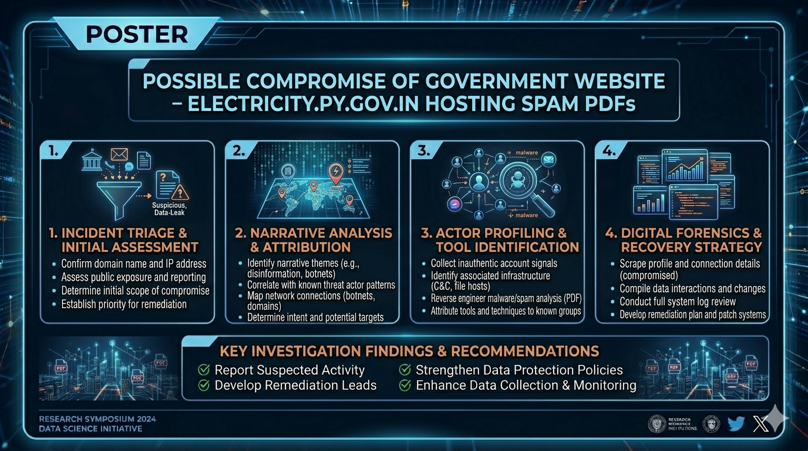

# Possible Compromise – Government Website Hosting Spam Content

## 🧾 Overview
A potential security incident was identified involving a government website hosting unauthorized and irrelevant content in the form of spam PDF files.

The affected domain belongs to a government entity and was found serving content unrelated to its official purpose.

---

## 🎯 Affected Asset
- **Domain:** electricity.py.gov.in  
- **Organization:** Government of Puducherry  

---

## ⚠️ Issue Summary
Multiple PDF files containing spam-related content (e.g., social media follower scams) were discovered hosted on the government domain and indexed by search engines.

---

## 🔍 Description
During open-source reconnaissance, several PDF files were identified via search engine indexing that:

- Were hosted on the official domain
- Contained unrelated and spam-like content
- Appeared to be unauthorized

This behavior suggests a possible:
- Website compromise  
- Unauthorized file upload vulnerability  
- Misconfigured file storage or CMS  

---

## 🚨 Security Impact
- Misuse of a trusted government domain for spam distribution  
- Increased risk of phishing or scam campaigns  
- Potential malware distribution vector  
- Reputational damage and loss of public trust  

---

## 📅 Timeline
- **Date of Discovery:** 24 March 2026  

---

## 🛡️ Responsible Disclosure
The issue was reported responsibly to the relevant authorities.

- No exploitation was performed  
- Only publicly accessible data was reviewed  
- Evidence was shared responsibly with the concerned team  

---

## 📸 Evidence (Sanitized)
> Screenshots and recordings were captured demonstrating:
- Search engine results showing indexed spam PDFs  
- Example content from the hosted PDF files  

> Note: Sensitive URLs and identifiers have been redacted to prevent misuse.

---

## ✅ Mitigation Recommendations
- Perform a full security audit of the web server and CMS  
- Remove all unauthorized files from the server  
- Implement strict file upload validation mechanisms  
- Restrict directory listing and public file access  
- Monitor logs for suspicious activity  
- Apply regular security patches and updates  

---

## 🏁 Conclusion
The presence of spam content on a government domain strongly indicates a possible compromise or misconfiguration. Immediate remediation and investigation are required to prevent further misuse and protect public trust.

---

## 🙌 Acknowledgement
This issue was responsibly disclosed to the relevant authorities, including CERT-In (**Indian Computer Emergency Response Team**). The report was acknowledged, contributing to improved security awareness and remediation.
