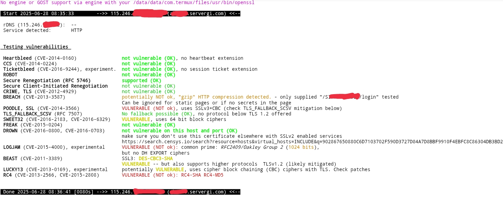
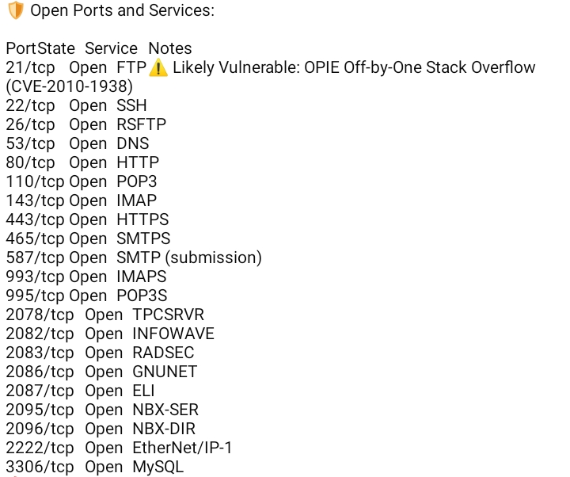
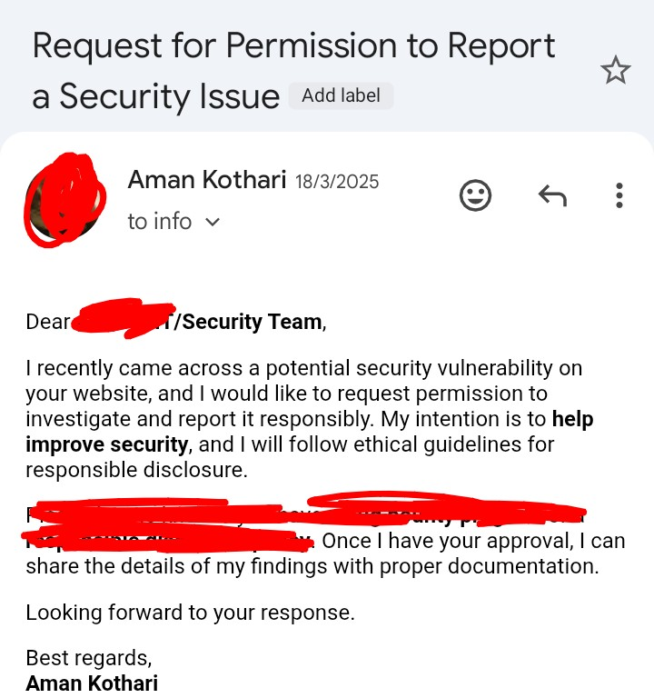
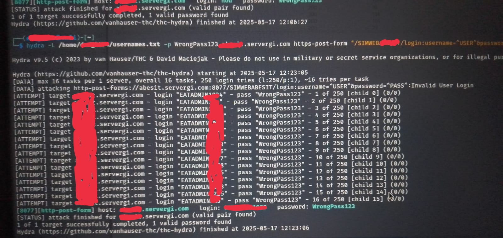
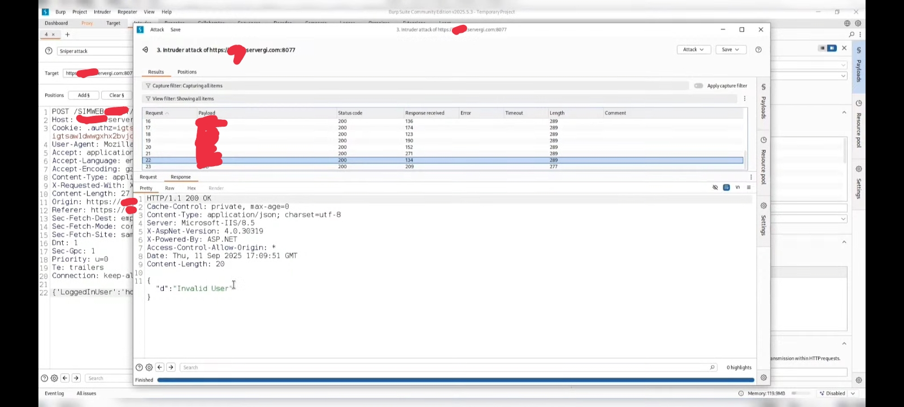
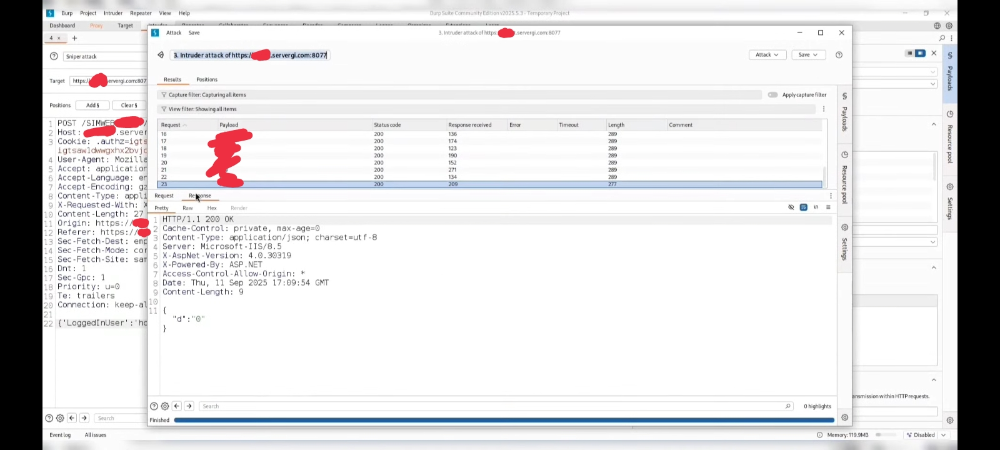
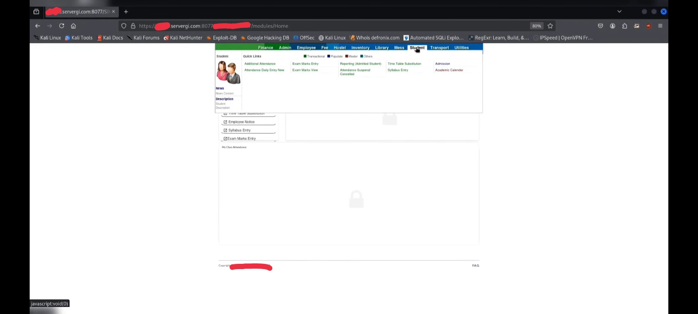

# How I Hacked my College Attendance System - Not for Marks, but for Respect

2023 - the year I took admission into college.
Like most freshers, I was curious, observant, and already deep into cybersecurity. One day, a friend (Hacker K) casually said:
> Yaha ek Attendance System (eSIM) hai... usko hack krna hai.

That sentence planted a **wishlist** in my mind.
Not ego. Not marks. Not for Attendance. Just Curiosity 
> By the way in my college for 1st year students 79.99% attendance is mandatory.

At that time, I didn't even know what system - but I knew one thing:

**If a system exists, it can be broken.**

---

## The First Reality Check
I started finding Vulnerabilities - a lot of them
But none were **directly exploitable**

### From OSINT:
```bash
*.servergi.com:8077/ISI/login*
Registrant, Admin, Biling, Tech Name: Agarwal, Vineet
Street: <Redacted for Privacy>
City: -
State: U.P.
Postal Code: 2010xx
Country: IN
Phone: +9199xxxxxxxx
Email: <some-email@gmail.com>
<alternate-mail@rediffmail.com>

4 person who have access:-
1. Admin1
2. Admin2
3. Admin3
4. Admin4
```

> Note - All the Information above is Reacted for Privacy (including names who have access of admin panel)

### Testssl.sh

**Fig-1: Openssl Output**

### Open Ports and Services 


**Fig-2: Open Ports and Services**

and some other vulnerabilities...

---

## The Day My Ego Hit
A professor from **New York University** was visiting for a **Cybersecurity Lecture.** Registration was mandatory - I registered.
When I reached the auditorium, I was stopped. Not because I wasn't registered. Not because of capacity. Because of **clothes**. really!!!, anyway

They said:
- Entry only in College Blazer.
- Remove hoodie if you want to enter.

In front of everyone, That moment felt like self-disrespect. Not discipline - humiliation.

I walked away. And that day, in anger I said to one of my friend:
> Ek din inka Attendance system hack krunga.

That line stayed with me.

---

## Ignored Responsible Disclosure 
Later, in **good faith**, I emailed the department about **severe Vulnerability.**

1. No Reply
2. No acknowledgement
3. Not even a read.

That's hurt more than auditorium incident because silence from authority is the loudest form of disrespect.
Anyway That is the part of life of every Bug Hunter.



**Fig-3: Ignored Responsible Disclosure**

---

## Betrayal Inside the Canteen 
One day, my friend (Hacker K) showed me something shocking. He had admin level access - Admin Credentials.
We had worked on findings together but he refused to share the credentials. That moment felt like betrayal.
Not because of credentials - but because of **credit and trust was broken.**

That's when I decided:
> Ab to me khud hi system compromise krunga

--- 

## 0x01: Defeating the "200 OK" Illusion
The college portal thought it was clever. Every login attempt doesn't matter **valid** or **invalid** responded with `HTTP 200 OK` To a basic script like **Hydra**, this creates a Wall of false positives. It's a classic "Security through Obscurity" move designed to annoy **script kiddies**.


**Fig-4: Hydra Output**

---

**The Counter-Move:** I didn't care about the status code. I cared about **Entropy**. Using **Burp Intruder**, I amalyzed the response length of the `JSON` Payload.

**The Noise:** 
`{"d":"Invalid User"}`

**Fig-5: Depicted "Invalid User" (Login Failed) at the time of Bruteforce**

**The Signal:**
`{"d":"0"}`

**Fig-6: Successfully Logged-In using Bruteforce approach with Burp Intruder**


A difference of just a few bytes was the "leak" I needed. By sorting the attack results by **Response Length**, I stripped away the camouflage.
Later when I told this to another friend (Hacker R) then Within few minutes, He had the clear-text credentials for 20 professors. The "Uniform" they enforced at the door meant nothing when their backend was leaking success signals.


**Fig-7: Finally got the Admin Access**

---

## 0x02: The Logic Kill-Switch (Parameter Tampering)
Gaining access wasn't enough. I wanted to own the session. so my friend (Hacker R) discovered that the application's state machine was built on trust - a fatal mistake in InfoSec.

**The Exploit:**
While Intercepting the logout and authentication traffic, He identified a recurring parameter: "d".
By using **Burp Repeater** to manipulate the server-bound response, He injected a specific state: `{"d":"-1"}` 

**The Result:** The server-side session management collapsed. Even after a "Logout" event, the system interpreted the tampered value as a persistent authenticated state. He had achieved **Persistent Session Hijacking** without needed to **re-log**.

**The Lesson:** *Respect the Logic, or the logic will break you.*
