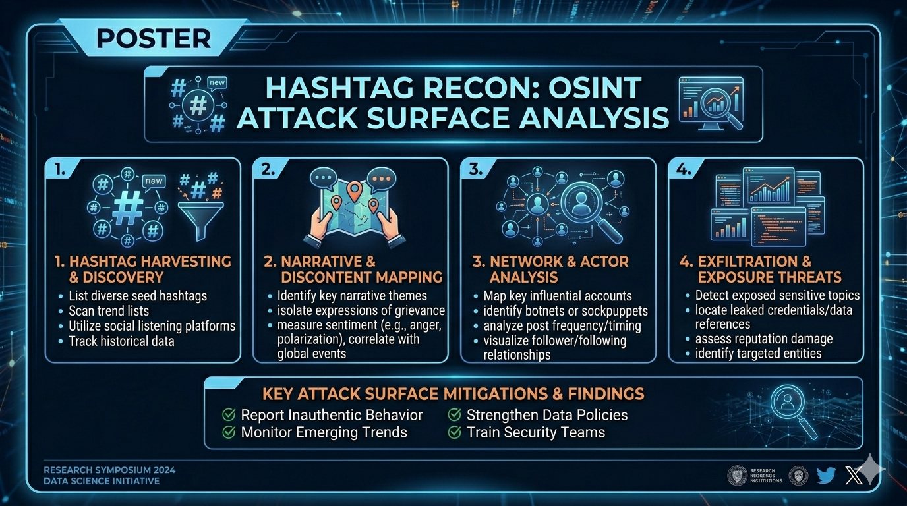
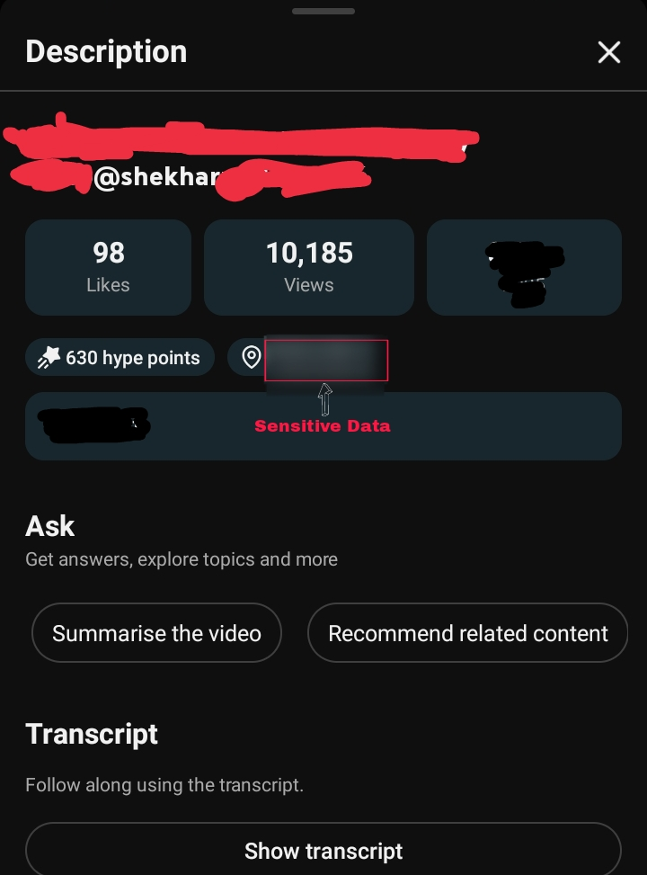
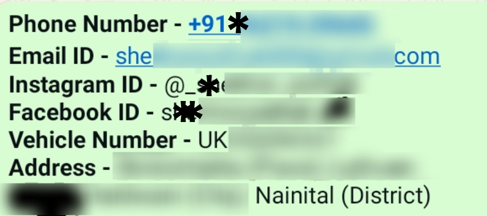

# Hashtag Recon: OSINT Attack Surface Analysis

This report presents an Open-Source Intelligence (OSINT) investigation conducted on a locally referenced YouTuber using minimal initial input.

## 1. Executive Summary
> Starting with only a name, publicly available information was systematically analyzed across multiple platforms. Through content review, hashtag analysis, and cross-platform correlation, additional personal information was discovered. The case highlights how seemingly harmless elements such as hashtags and public content can unintentionally expose sensitive personal information.

> ⚠️ **Note:** All sensitive data has been redacted in this report for ethical and privacy reasons.

## 2. Scope of Investigation 

**Target Type:** Individual (Local YouTuber)

**Initial Input:** Name only

**Data Sources:**
- YouTube
- Public social media platforms
- Search engines

## 3. Methodology
### Tools & Techniques used
- Google Images
- Google Search

### Investigation Approach
1. Initial identification via YouTube search
2. Image extraction and reverse search
3. Content and metadata analysis
4. Hashtag intelligence gathering
5. Geolocation narrowing
6. Cross-platform correlation
7. Information validation

---

## 4. Investigation Process
### 4.1 Initial Identification
The investigation began with a name provided through an external reference.

A targeted search was conducted on YouTube using the name combined with location-specific keywords. A matching profile was identified with the help of a reference image, confirming the correct individual.

### 4.2 Image Analysis
Multiple screenshots were captured from videos and profile images. Reverse image searches were conducted. However, no additional useful information was obtained from this method.

### 4.3 Content Analysis
All publicly available videos were reviewed to identify potential links to other social media accounts or identifying information. No direct external links were found in descriptions or channel metadata.

### 4.4 Engagement Attempt 
A passive attempt was made to gather contextual information by interacting via the comment section. No response was received.

### 4.5 Hashtag Intelligence (Key Findings)
Video descriptions included multiple location-based hashtags.

These hashtags were extracted and analyzed, revealing references to specific geographic regions. This allowed narrowing down the probable location associated with the individual.

### 4.6 Geolocation Correlation
The identified hashtags were mapped to real-world locations, significantly reducing the search scope. This enabled more targeted investigation and contextual understanding of the individual's environment.

  

### 4.7 Cross-Platform Correlation
Using collected identifiers, advanced search queries were performed to locate related profiles on other platforms. A linked social media account was identified, which led to further associated profiles through connections and followers.

### 4.8 Information Expansion
Correlation of multiple public sources resulted in the discovery of additional personal information, including contact related data and extended social presence.

> All sensitive details have been redacted for ethical reasons.

## 5. Key Findings
- Identification of target using minimal input (name only).
- Successful use of hashtags for geolocation narrowing.
- Discovery of linked social media profiles.
- Expansion of digital footprint through cross-platform correlation.
- Exposure of sensitive personal information (redacted).

## 6. Risk Analysis
**The investigation demonstrates the following risks:**

- Exposure of personal contact information.
- Increased susceptibility to phishing and social engineering.
- Potential for stalking or targeted attacks.
- Unintentional leakage of location data through hashtags.

## 7. Recommendations
- Avoid using highly specific location-based hashtags.
- Limit public exposure of personal identifiers.
- Review and restrict social media privacy settings.
- Avoid linking multiple platforms publicly.
- Be cautious of digital footprint expansion.
