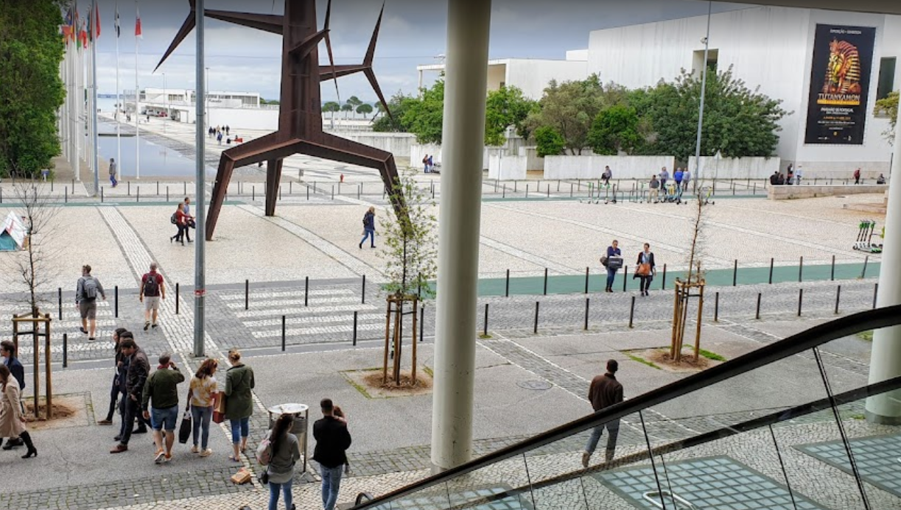

# Image Geolocation & Temporal Analysis – Tutankhamun Poster Case

## 1. Executive Summary
This report presents an Open-Source Intelligence (OSINT) investigation focused on geolocating an image and determining its approximate time 
of capture.

Through visual landmark identification and contextual analysis of an exhibition poster, the image was successfully linked to a specific 
location in Lisbon, Portugal. Additionally, event-based evidence enabled the estimation of the timeframe in which the image was taken.

The investigation demonstrates how combining spatial and temporal clues can significantly increase confidence in OSINT findings.

## 2. Objectives

- Identify the location where the image was captured
- Determine the approximate time frame of the image
- The big poster on the right contained a link to a website. What was the link?

## 3. Methodology
## Tools & Techniques Used
- Google Images
- Google Maps
- Google Dorking

### Investigation approach
1. Visual landmark identification
2. Environmental and architectural analysis
3. Poster content extraction
4. Event correlation and verification
5. Location confirmation via mapping tools

## 4. Investigation Process
### 4.1 Visual Landmark Identification

The image contains a distinctive large metallic sculpture in an open urban plaza. The structure’s unique design served as a primary visual 
anchor for geolocation.

Additional environmental elements such as paved walkways, pedestrian layout, and surrounding architecture suggested a modern European setting.

### 4.2 Geolocation Analysis

Through visual comparison and mapping tools, the sculpture was identified as the "Homem Sol" statue located in Lisbon, Portugal.

**Coordinates:**
[38.767644, -9.096053](https://goo.gl/maps/avBAmAD1AEi6onnG6)

### 4.3 Poster Analysis

A poster visible in the image was isolated and analyzed. The poster contained the following information:

- **Event:** Tutankhamon – Treasures of Egypt
- **Venue:** Portugal Pavilion, Lisbon (Park of Nations)
- **Website:** www.tutankamon.pt

[Poster](Images/Screenshot_20260320-152714~2.png)

### 4.4 Location Correlation

The Portugal Pavilion is situated within the Park of Nations (Parque das Nações), which is geographically consistent with the identified location of the Homem Sol statue
This spatial alignment confirms the accuracy of the geolocation.

**📍 Reference:** Portugal Pavilion

### 4.5 Temporal Analysis

The poster indicates that the exhibition began on 19 April 2019.
Based on this information, the image must have been captured on or after this date. Given the promotional nature of the poster, it is highly likely that the image was taken during the active exhibition period in 2019.

## 5. Key Findings

- The image was geolocated to Lisbon, Portugal.
- **Specific location identified:** Near Homem Sol statue (Park of Nations).
- Exhibition poster provided strong contextual evidence.
- Timeframe narrowed to April 2019.
- High-confidence correlation between spatial and temporal data.

## 6. Confidence Assessment

Location Confidence: High 
Timeframe Confidence: High

**Reason:**
- Unique landmark match
- Verified real-world location
- Event-based temporal evidence
- Cross-validation using multiple sources
