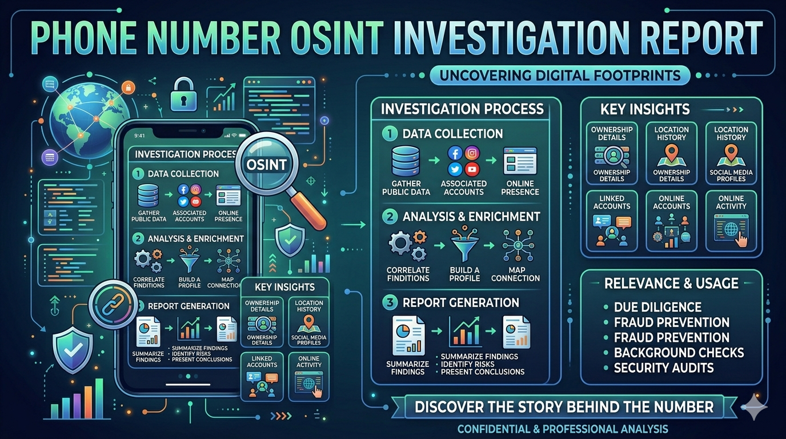

# 📱 Phone Number OSINT Investigation Report

## Case Overview
- **Target Identifier:** +91-9XXXXXXXXX
- **Investigation Type:** Open Source Intelligence (OSINT)
- **Scope:** Passive reconnaissance using publicly available information
- **Analyst:** [Aman Kothari](https://www.linkedin.com/in/aman-kothari-995944274/)
- **Date:** ---

## Objective

To assess the digital footprint associated with a phone number and identify potential privacy, traceability, and security risks using structured OSINT methodologies.

## Methodology

A multi-phase investigative approach was followed:

### Phase 1: Search Engine Enumeration
- Querying multiple formats of the phone number
- Use of search operators (quotes, filetype filters)

### Phase 2: Platform Enumeration
- Messaging platforms (WhatsApp, Telegram)
- Extraction of usernames and metadata

### Phase 3: Pivoting & Correlation
- Username-based pivoting
- Profile image comparison
- Bio and activity pattern analysis

### Phase 4: Metadata & Number Analysis
- Prefix evaluation and structural analysis
- Historical allocation inference

### Phase 5: Validation & Risk Assessment
- Multi-source verification
- Confidence scoring
- False positive elimination

## 1. Search Engine Enumeration

### Queries Used:
- "9XXXXXXXXX"
- "+919XXXXXXXXX"
- "9XXXXXXXXX" filetype:pdf

### Findings:
- No direct personal identity indexed
- Minor references in non-sensitive directories

### Analysis:
Search engine exposure is minimal, indicating limited direct indexing of the number.

---

## 2. Messaging Platform Analysis

### WhatsApp
- Display Name: [Redacted]
- Profile Photo: Present
- About Section: Minimal

### Telegram
- Username: @example_user
- Bio: Generic

### Observations:
- Consistent identity indicators across platforms
- Reusable username increases traceability

---

## 3. Cross-Platform Correlation

| Attribute              | Observation |
|----------------------|------------|
| Username reuse       | Yes        |
| Profile image reuse  | Yes        |
| Identity linkage     | Moderate confidence |

### Insight:
Multiple weak signals combine to form stronger attribution confidence.

---

## 4. Numbering & Metadata Analysis

### Reference:
 [Mobile Telephone Numbering in India](https://en.wikipedia.org/wiki/Mobile_telephone_numbering_in_India)

- Country Code: +91
- Prefix: 9XXX
- Inference: Early-generation mobile allocation  
- Observation: Long-term usage increases probability of historical exposure

---

## 5. Breach Exposure Risk Analysis

### Observations:
- Large-scale data exposure incidents have demonstrated the risks of phone number-based identity linkage

### Implications:
- Phone numbers act as strong pivot points
- Correlation effort significantly reduced when combined with public data

### Risk Level:
🟡 Medium

---

## 6. OPSEC (Operational Security) Assessment

### Observations:
- Phone number linked to messaging platforms
- Public visibility of profile attributes
- Lack of identity compartmentalization

### OPSEC Rating:
Medium

### Analysis:
The target exhibits moderate OPSEC awareness but lacks separation between digital identities.

---

## 7. Behavioral Pattern Analysis

### Observations:
- Consistent username format
- Similar profile structure across platforms
- Minimal anonymization

### Inference:
Indicates stable identity usage with limited obfuscation practices.

---

## 8. Geographical Indicators

### Data Points:
- Country Code: +91
- Language Pattern: English / Hinglish
- Activity Window: IST-aligned

### Inference:
Likely operating within India region (non-confirmed).

---

## 9. Pivoting Techniques Applied

- Phone number → Messaging platforms  
- Username → Social media discovery  
- Profile image → Visual correlation  
- Bio keywords → Contextual inference  

### Insight:
Attribution achieved through multi-directional pivoting rather than single-source dependency.

---

## 10. Data Validation Process

### Steps Taken:
- Cross-verification across platforms  
- Consistency checks (username, images, metadata)  
- Elimination of single-source conclusions  

### Result:
Findings validated through multiple independent indicators.

---

## 11. False Positive Analysis

### Risks:
- Common usernames may cause misattribution  
- Non-unique images may reduce confidence  

### Mitigation:
- Required multiple matching indicators before confirmation  
- Avoided assumptions based on isolated data points  

---

## 12. Identity Confidence Assessment

| Indicator              | Strength |
|----------------------|----------|
| Username correlation | High     |
| Profile image match  | Medium   |
| Platform linkage     | High     |

### Final Confidence Level:
Medium to High

---

## 13. Security Risks Identified

- Profile photo exposure → identity recognition risk  
- Username reuse → cross-platform traceability  
- Phone number linkage → enumeration risk  

---

## 14. Recommendations

- Restrict profile visibility on messaging platforms  
- Disable phone number-based discovery  
- Use unique usernames across platforms  
- Avoid linking phone numbers to public services  
- Perform periodic digital footprint audits  

---

## 15. Risk Assessment Summary

| Category            | Risk Level |
|-------------------|------------|
| Identity Exposure | Medium     |
| Traceability      | Medium     |
| Correlation Risk  | Medium     |

### Overall Risk:
**Medium**

---

## 16. Tools & Techniques Used

- Manual search engine queries  
- Platform-based enumeration  
- Pattern recognition and correlation  
- Public data analysis

---

## 17. Useful OSINT Resources

The following platforms can assist in phone number investigations, breach analysis, and cross-platform intelligence gathering:

- [**databreach.io**](https://databreach.io/) - Used for identifying potential data breach exposures linked to emails or phone numbers.

- [**lookups.io**](https://lookups.io/) - Provides reverse lookup capabilities for phone numbers and related metadata.

- [**Whitepages**](https://www.whitepages.com/reverse-phone) - Useful for basic identity lookup, phone number tracing, and public directory information.

- [**Pastebin**](https://pastebin.com/) - Helps in discovering leaked data, dumped credentials, or references to identifiers in public pastes.

- **Ahmia**  
  A search engine for Tor (.onion) services, useful for exploring dark web indexed content.

---

### Usage Insight:
These platforms should be used in combination rather than isolation.  
Cross-verification across multiple sources significantly improves accuracy and reduces false positives.

---

### Caution:
- Data obtained may be outdated or partially accurate  
- Always validate findings through multiple independent sources  
- Avoid reliance on a single platform for attribution

---

## Conclusion

The investigation demonstrates that even in the absence of direct search engine exposure, a phone number can serve as a critical pivot point for identity correlation.

Attribution was established through cumulative weak signals rather than reliance on a single strong identifier.

The primary risks stem from inadequate operational security practices rather than technical vulnerabilities.
