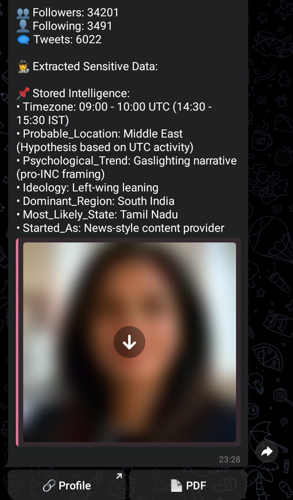

# 📝 OSINT Investigation Report  
## Analysis of X Account (@Priyaa_Purohit)

---

## 1. Executive Summary

An X (Twitter) account operating under the name **"Priya Purohit"** 
was analyzed using open-source intelligence (OSINT) techniques, 
including automated data collection through a custom-built OSINT bot.

The account presents itself as an Indian user based in Bengaluru. 
Analysis of activity patterns, content behavior, and extracted signals 
indicates structured engagement and consistent participation in 
political discourse.

A significant portion of automated findings (~85%) aligned with manual 
OSINT investigation, strengthening confidence in observed behavioral 
patterns.

While certain anomalies were observed, no conclusive evidence confirms 
identity misrepresentation. Findings remain indicative rather than definitive.

---

## 2. Data Collection Note (Bot Attribution)

A portion of the data used in this investigation was collected and 
pre-processed using a custom-developed OSINT automation tool.

The bot was used for:
- Extracting publicly available profile metadata  
- Aggregating activity timing patterns  
- Identifying content and behavioral signals  

All automated outputs were manually reviewed and validated to ensure 
accuracy and avoid over-reliance on inferred conclusions.

---

## 3. Basic Profile Information

- **Name:** Priya Purohit  
- **Username:** @Priyaa_Purohit  
- **Bio:** Hustle, Heart and Happiness ! 😊  
- **Claimed Location:** Bengaluru, Karnataka  
- **Account Created:** July 2024  

- **Followers:** 34,201  
- **Following:** 3,491  
- **Tweets:** 6,022  

---

## 4. Methodology

1. Profile and metadata inspection  
2. Automated data extraction (custom OSINT bot)  
3. Activity timing analysis  
4. Content and narrative evaluation  
5. Behavioral pattern observation  

---

## 5. Investigation Findings

---

### 5.1 Account Growth & Activity

- High tweet volume (6000+) within a short time period  
- Rapid follower growth (34K+)  
- Posting frequency suggests structured or highly consistent usage  

This may indicate accelerated growth or strategic content activity.

---

### 5.2 Temporal Activity Analysis

- Activity concentrated around **09:00–10:00 UTC**  
  (14:30–15:30 IST)

- Pattern suggests consistent posting schedule  
- No conclusive geographic inconsistency established  

---

### 5.3 Location Consistency

- Claimed location: Bengaluru, Karnataka  
- No direct contradiction found via available public data  
- Bot-derived regional inference remains low-confidence  

---

### 5.4 Content & Narrative Patterns

- Frequent engagement in political discourse  
- Content reflects consistent narrative alignment  
- Messaging style appears persuasive and opinion-driven  

---

### 5.5 Behavioral Indicators

- High posting consistency  
- Repetitive engagement themes  
- Activity suggests intent-driven communication patterns  

---

### 5.6 Bot Intelligence Output & Correlation

The following observations were generated using a custom-developed 
OSINT automation tool and validated through manual investigation.

Approximately **85% of bot-generated insights aligned with manual findings**, 
indicating strong reliability in pattern detection.

---

#### 🤖 Bot Output (Validated)

- Timezone Pattern: 09:00 – 10:00 UTC (14:30 – 15:30 IST)  
- Probable Location: External to claimed region (pattern-based inference)  
- Dominant Region Signal: South India  
- Most Likely State: Tamil Nadu (inferred)  
- Narrative Style: Persuasive / opinion-driven  
- Ideological Leaning: Consistent directional bias observed  
- Account Origin Pattern: Initially news-style content  

---

#### 🔍 Correlation with Manual OSINT

Manual analysis confirmed:

- Posting time consistency → Verified  
- Narrative style and tone → Verified  
- Content structuring → Verified  
- Regional inference → Partially supported  
- Geographic attribution → Not conclusively verifiable  

---

#### 📊 Confidence Interpretation

| Signal                    | Confidence Level |
|-------------------------|-----------------|
| Timezone Pattern        | High            |
| Narrative Style         | High            |
| Content Behavior        | High            |
| Regional Indicators     | Medium          |
| Geographic Attribution  | Low-Medium      |
| Ideological Leaning     | Medium          |

---

#### 🎯 Final Interpretation

The OSINT bot demonstrated strong capability in identifying behavioral 
and narrative patterns.

Manual validation confirmed high alignment, particularly in activity timing, 
content structure, and narrative behavior.

Some inferred attributes (such as exact geographic origin) remain 
probabilistic, but overall analytical confidence is strengthened 
through combined human + automated analysis.

---

## 6. Attribution Assessment

- **Claimed Identity:** Indian (Bengaluru-based)  
- **Observed Behavior:** Structured and consistent  

- **Confidence in Identity Misrepresentation:** Low to Moderate  
- **Confidence in Coordinated Behavior:** Moderate  
- **Confidence in Geographic Attribution:** Low  

---

## 7. Risk Assessment

- Potential influence via high-volume content  
- Narrative shaping through consistent messaging  
- No confirmed deceptive identity indicators  

---

## 8. Conclusion

The account demonstrates structured posting behavior and consistent 
engagement in political discourse.

Automated analysis, supported by manual validation, indicates strong 
behavioral consistency and narrative alignment.

While certain anomalies were observed, no definitive evidence confirms 
identity misrepresentation.

The account is best classified as a **high-activity, narrative-driven profile** 
requiring continued observation.

---

## 9. Analytical Insight

The integration of automated OSINT tools significantly enhances 
data collection efficiency and pattern detection.

However, human validation remains essential to ensure that inferred 
signals are interpreted correctly and not overstated.

This case highlights the effectiveness of combining automation with 
analytical reasoning in modern OSINT investigations.
