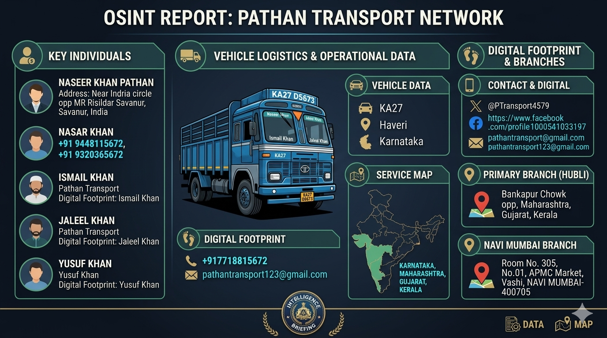

# Subject: Correlation Analysis of X Account & “Pathan Transport” Entity

## 1. Objective

To identify and gather publicly available information about a Twitter user who was involved in posting abusive content towards **Hindu [Gods](Images/Gods.jpg)** using only open-source intelligence (OSINT) techniques.

- **X (Twitter) account:** @PTransport4579 (**Username:** Khan4355)
- A transport business operating under the name “**Pathan Transport**”
- Associated individuals, vehicles, locations, and contact identifiers

---

## 🧠 Initial Observation

- Platform: X (Twitter)
- Username: **Khan4355** (Now changed to **Baap**)
- Handle: **@PTTransport4579**
- Profile Picture: [Truck image](Images/Truck.jpg) (Goods Carrier)

The investigation was initiated based on the **display picture (DP)**, which showed a transport truck.

---

## 🔍 Step 1: Image Analysis

The profile picture contained a **decorated Indian transport truck** with visible text.

### Extracted Clues:
- "Goods Carrier"
- "Pathan Transport"
- Names written on vehicle:
  - Ismail Khan
  - Jaleel Khan
  - Yusuf Khan
- Registration Code: **KA27**

---

## 🌍 Step 2: Vehicle & Location Tracing

### RTO Code Analysis:
- **KA27 → Haveri District, Karnataka**

### Constituency Found:
- **Shiggaon Constituency (Karnataka)**

This narrowed down the geographic location significantly.

---

## 🏢 Step 3: Organization Identification

From the truck branding:
- Company Name: **Pathan Transport**

Further OSINT revealed:
- Business Type: Fleet Owners & Transport Contractors
- Operational Areas:
  - Karnataka
  - Maharashtra
  - Gujarat
  - Kerala

---

## 👤 Step 4: Identity Correlation

Using name + transport company correlation:

### Possible Identity:
- **Name:** Naseer Khan Pathan  
- Associated with: Pathan Transport

---

## 📞 Step 5: Contact Information Discovery

### Phone Numbers:
- +91 9448115672 (BSNL)
- +91 9320365672 (Reliance Jio)
- +91 7718815672 (Airtel)

### Emails:
- pathantransport@gmail.com  
- pathantransport123@gmail.com  

---

## 📍 Step 6: Address Mapping

### Primary Location:
- Near Indira Circle  
- Opp MR Risildar Hospital  
- Savanur, Karnataka  

### Secondary Location:
- Room No. 305  
- Central Facility Building No. 01  
- APMC Market, Vashi  
- Navi Mumbai – 400705  

---

## 🔗 Step 7: Social Media Linkage

- Facebook Profile Identified:
  - https://www.facebook.com/profile.php?id=100054610533197

---

## 🧩 Final Analysis

Using only a **single profile image (truck DP)**, the following was achieved:

✔ Vehicle identification  
✔ Location tracing via RTO  
✔ Business identification  
✔ Associated individuals  
✔ Contact details  
✔ Physical addresses  
✔ Linked social media  

---

## 🧠 Target Reaction Analysis

After being presented with extracted information:

- Target deleted Facebook posts
- Changed Twitter profile picture [Tires Image](Images/Tires.jpg)
- Removed identifiable content

### Interpretation:
This indicates:
- Awareness of exposure
- Attempt to reduce digital footprint
- Shift toward anonymity (basic OPSEC)

## ⚠️ Ethical Note

This investigation was conducted using **publicly available information only**.

This report is strictly for:
- Educational purposes  
- OSINT practice  
- Awareness of digital footprint exposure  

❗ Misuse of such information for harassment, threats, or doxxing is unethical and potentially illegal.

---

## 🏁 Conclusion

This case highlights how even a **simple profile picture** can expose extensive real-world information when analyzed properly using OSINT techniques.

> "On the internet, even silence leaves fingerprints."

---
